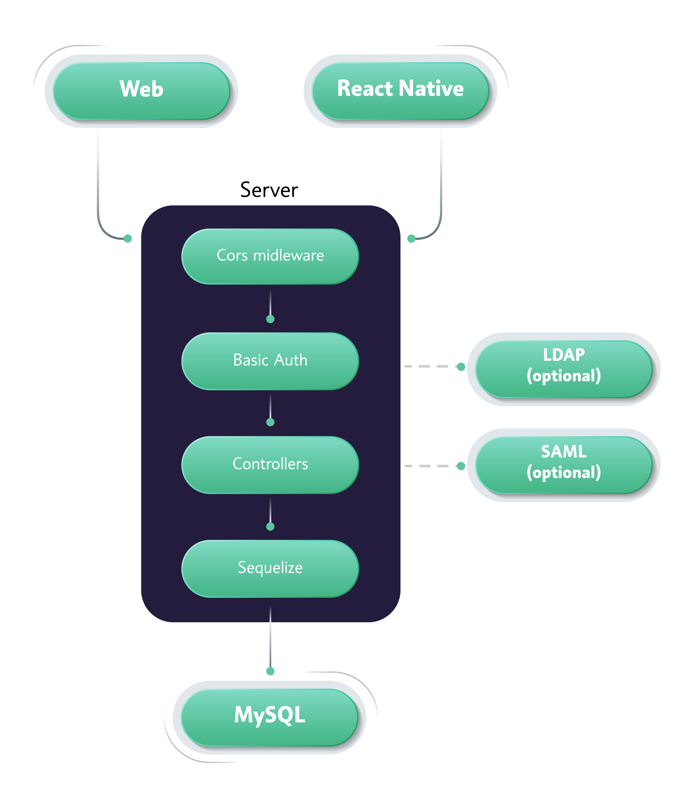
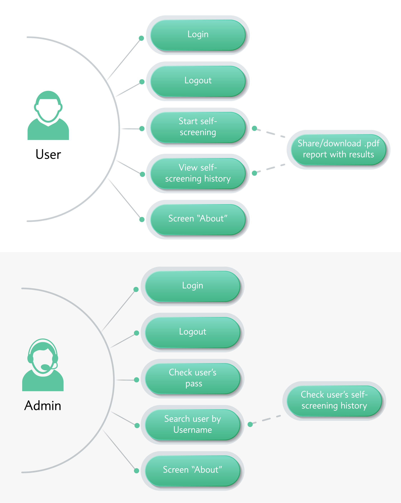

# Workhealth
The workhealth application helps prevent the spread of the virus among medical specialists by allowing them to timely identify the symptoms and notify the manager in advance. The app is intended to be used on a daily basis (i.e. every morning) before a medical specialist goes to work. Upon launching the app, a user will have to go through a list of questions that will determine whether an employee is eligible for work in accordance with the described symptoms. In case the employee is permitted to go to work, they will receive a personal one-day code. They will have to share this code upon arriving to work so the guard or the administrator can check its validity. New codes are generated on a daily basis so a user cannot use the same code for more than one day.
# Tech Stack
### Frontend, Mobile application
- [React](https://github.com/facebook/react) / [React Native](https://facebook.github.io/react-native/)
- [React Navigation](https://github.com/react-community/react-navigation)
- [Redux](https://redux.js.org/)
- [Redux-Persist](https://github.com/rt2zz/redux-persist)
### Backend
- [Express](https://github.com/expressjs/express)
- [Sequelize](https://github.com/sequelize/sequelize) 
- [Swagger](https://github.com/swagger-api/swagger-node)
# Architecture

# Use case diagram

# Contact information
<contact@kandasoft.com>
# License
This code is distributed under the terms and conditions of the [MIT](LICENSE)
