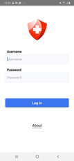
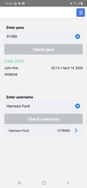
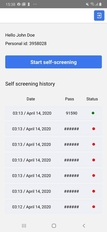
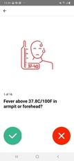
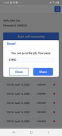

# Workhealth
## How to build and run the app:

### iOS:
Cocoapods should be installed
```
$ npm run refresh (In case there is some problems with finding pods - try pod repo update)
$ npm run ios (or Run with Xcode)
```

### Android:
```
$ npm run refresh
$ npm run android
```

### Username & Password for testing
```
username: 'john
password: '123',
role: 'user'
```
```
username: 'doe
password: '123',
role: 'admin'
```

##### For integration with third-party backends change BASE_URL and endpoints
```js
export const login = `/auth/login`;
export const questionnaire = `/questionnaire`;
export const currentHistory = '/screeningHistory/current';
export const historyByPass = pass => `/screeningHistory?pass=${pass}`;
export const historyUserId = userId => `/screeningHistory?userId=${userId}`;
export const historyByUsername = username => `/user?username=${username}`;
export const answerByPass = (id) => `/screeningHistory/answers/${id}`;

export const BASE_URL = 'http://your.base.url';
```

##Application example
####[Android](https://install.appcenter.ms/orgs/alexey-shevchik-organization/apps/selfscreening/distribution_groups/public)
####[iOS](https://install.appcenter.ms/orgs/alexey-shevchik-organization/apps/self-screening/distribution_groups/public)

---
   
   

## Designed & Created by
[](https://www.kandasoft.com/) [](https://softteco.com/) 
