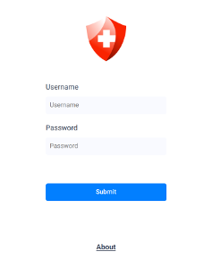
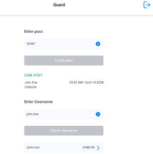
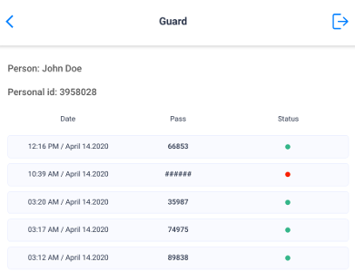
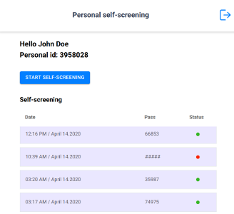
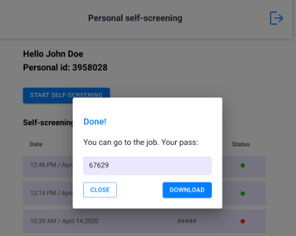

# Workhealth
## How to build the app

```
yarn build
```
### Username & Password for testing
```
username: 'john
password: '123',
role: 'user'
```
```
username: 'doe
password: '123',
role: 'admin'
```

#### For integration with third-party backends change BASE_URL and endpoints
```js
export const login = () => api.get('/auth/login')
export const getScreeningHistoryByPass = pass => api.get(`screeningHistory?pass=${pass}`)
export const getScreeningHistoryByName = name => api.get(`user?username=${name}`)
export const getUserHisory = id => api.get(`screeningHistory?userId=${id}`)
export const screeningHistory = () => api.get('/screeningHistory/current')
export const getQuestionnaire = () => api.get('/questionnaire')
export const checkAnswers = answers => api.post('/questionnaire', answers)
export const getUserResult = id => api.get(`/screeningHistory/answers/${id}`)

export const BASE_URL = 'http://your.base.url/';
```
#### Technologies
[React](https://reactjs.org/), [Redux](https://redux.js.org/), [Rest API](https://restfulapi.net/)

[Page example](http://37.139.8.242/login)
---
  
 

## Designed & Created by
[](https://www.kandasoft.com/) [](https://softteco.com/)
